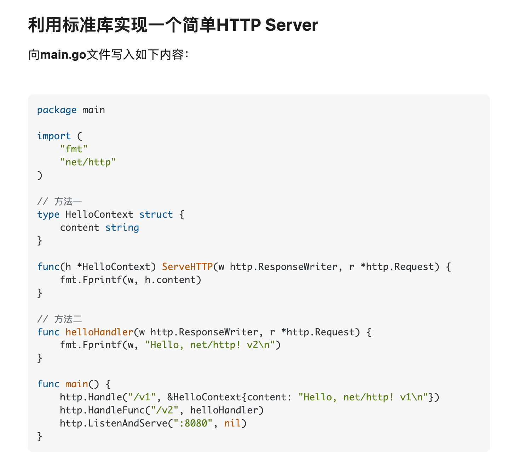

Sofar的个人博客
<!-- ## Astro Air Blog 是什么？

它是我基于 Astro 2.0 开发的一个博客模板，你可以直接使用它来搭建你的博客。我没有使用任何 CSS 框架以及 React 等前端框架，而是使用了 Astro 自带的组件库，这样可以让你的博客加载速度更快，同时也可以让你的博客更加轻量。

## 教程

[https://yufengbiji.com/posts/astro-air-blog-guide](https://yufengbiji.com/posts/astro-air-blog-guide)

## 预览

[https://yufengbiji.com](https://yufengbiji.com)

[https://astro.yufengbiji.com](https://astro.yufengbiji.com)

### 主页


### 文章黑暗模式


### 普通文章


### 语法高亮



### 三种图片显示模式


有三种图片显示模式: wide, big, inline. 当你编写 mark 文件的时候可以指定 wide 或 big 或 inline 到你的图片 alt 属性中, 比如这样:

```markdown

```

<strong>分割符号是`|`,默认的模式为 `big`.</strong>

## 🚀 项目结构

在这个项目中，你可以看到如下结构

```
|-- README.md
|-- astro.config.mjs
|-- package.json
|-- public
|   |-- favicon.svg
|   `-- static
|-- src
|   |-- components
|   |   |-- BaseHead.astro // 公共头部 head 标签
|   |   |-- Footer.astro  // 底部
|   |   |-- Header.astro // 头部
|   |   `-- Navigation.astro // 导航
|   |-- consts.js // 常量,包括网站的名称，地址等。
|   |-- env.d.ts
|   |-- layouts
|   |   |-- BaseLayout.astro
|   |   |-- MarkdownPost.astro
|   |   |-- MoreTile.astro
|   |   `-- Tile.astro
|   |-- pages
|   |   |-- about.astro
|   |   |-- archive.astro
|   |   |-- index.astro
|   |   |-- posts 
|   |   |   |-- some markdown post.md  // 这里写文章
|   |   |-- rss.xml.js // RSS feed
|   |   `-- tags
|   |       `-- [tag].astro // 标签页
|   |-- styles
|   |   `-- global.css // 全局样式
|   `-- utils.js
```

## 🧞 使用方法

在项目根目录下执行这些命令:

| 命令                | 动作                                           |
| :--------------------- | :----------------------------------------------- |
| `npm install`          | 安装依赖                           |
| `npm run dev`          | 本地预览 `localhost:3000`      |
| `npm run build`        | 编译生成静态网站，结果在 `./dist/`          |
| `npm run preview`      | 在发布之前，可以本地预览    |
| `npm run astro ...`    | Run CLI commands like `astro add`, `astro check` |
| `npm run astro --help` | Get help using the Astro CLI                     |

## 👀 想了解更多？

正在撰写相关文章。 -->
