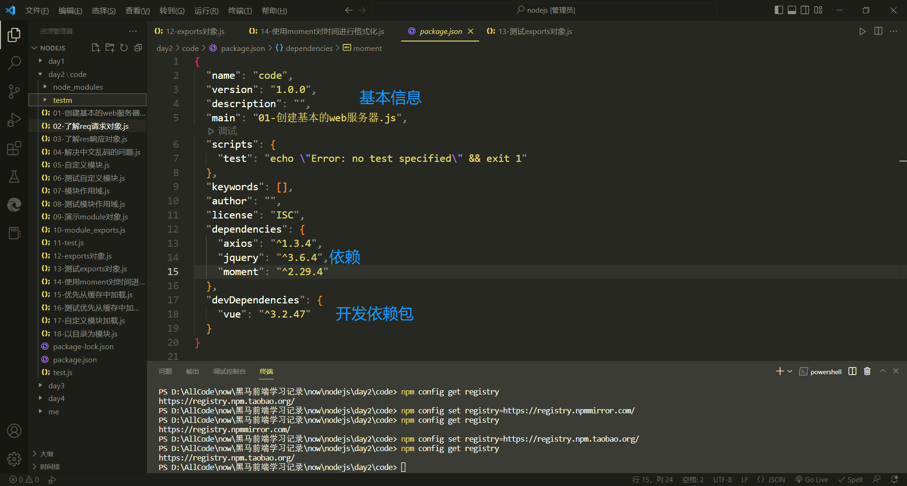

## 服务器、Http、ip、域名、端口

服务器：管理资源并为用户提供服务的计算机软件。  
Http：一种应用层协议（超文本传输协议），是为web浏览器和web服务器的通信而设计的。  
ip：互联网上每台计算机的唯一地址。  
域名：与ip地址相对应，方便记忆且直观。其对应关系存放在域名服务器当中（DNS）。  
端口：计算机的数个Web服务对应相应的端口。

## 基于nodeJs创建一个简单的web服务器

1. 导入http模块。
2. 创建web服务器实例
3. 为服务器绑定request请求事件，监听客户端的请求
4. 根据设置端口，启动服务器。
``` js 
// 第一步:引入http
const http = require('http');

// 第二部,创建server实例化对象
const server = http.createServer();

// 第三步,为服务器绑定访问事件(监听请求)
server.on('request', function (request, response) {
  console.log('请求访问服务器');
  console.log(request);
  console.log(response);
});

//第四步 启动服务器,当端口号为3000的时候启动服务器
server.listen(4000, function () {
  console.log('服务器启动');
})
```

## request请求对象

只要服务器接收到了客户端的请求，就会调用server.on()为服务器绑定request事件处理函数。  
1. **req.url()** 请求的url服务地址（ip地址之后的地址）。
2. **req.method()** 客户端请求的类型（POST 或 GET）。

## response响应对象

响应对象，包含了与服务器相关的属性。  
1. **res.setHeader()** 设置响应头，用于解决乱码问题。
2. **res.end()** 向客户端发送指定内容，并结束这次请求。

## 模块组件化module

**模块化** ：为解决一个复杂问题自顶向下逐层把系统划分为模块的过程。
**模块** ：指一种可以独立编译和调用的代码块，具有明确的接口，可以被其他组件调用，也可以调用其他组件。
模块化的优点：提高了代码的复用性、可维护性、可拓展性、以及按需加载节约性能。

nodejs的模块
1. require() 加载模块。
2. module.exports 向外共享模块。

## npm打包

**包** 也成为nodejs的第三方模块，nodejs下载时内置了npm。

**npm install 完整的包名称** 下载包 简写方式：**npm i 完整的包名称**  。
**npm install 完整的包名称@版本号** 安装指定版本的包。版本号分为三位，第一位表示大版本，第二位表示功能版本，第三位表示bug修复版本。
**package.json** 包管理配置文件，用来记录与项目有关的一些配置信息。



**npm init -y** 在执行命令所在的目录处,快速创建package.json。
**npm install** 一次性安装所有的包。
**npm uninstall 完整的包名称** 卸载一个包

**devDependence** 开发依赖 如果依赖包在项目上线以后用不到，则建议添加到devDependence节点中。

## npm镜像源

**npm config get registry**查看npm 镜像。
**npm config set registry=https://registry.npm.taobao.org/**切换镜像源

**nrm** 镜像管理包，快速管理各个npm镜像，查看和切换。
```js 
npm i nrm -g //安装nrm包
nrm ls  //查看各个镜像
nrm use taobao //切换成淘宝镜像
```


